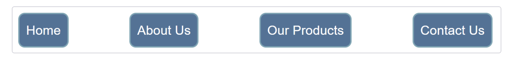
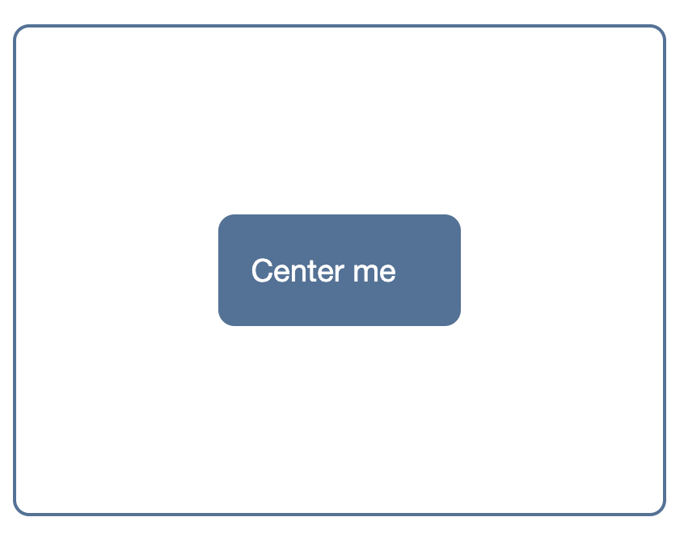
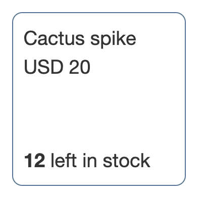
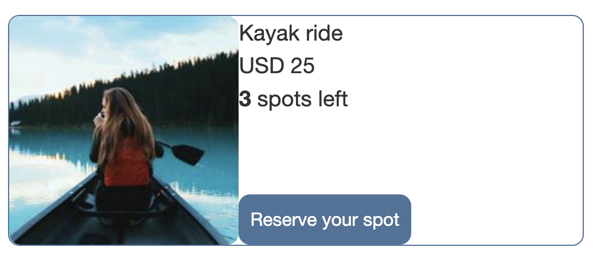
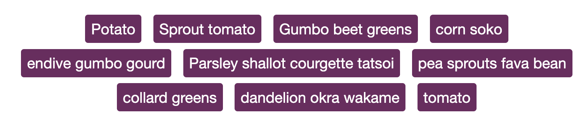

# Flexbox Challenge

For this challenge you need to use Flexbox to build each of the following exercises.

In the `index.html` you can find the base html for each excerise and in `styles.css` the base styles.

Your job is to adjust the code provided in order to reach the UI required by each exercise.

## Exercise 1

You have been provided with a list of items that are the navigation for a site. They should be laid out as a row, with an equal amount of space between each item. The finished example should look like the image below.

## Exercise 2

There are two elements in the HTML of Exercise 2, a div with a class of `.parent` which contains another div with a class of `.child`. Use Flexbox to center the child inside the parent.

## Exercise 3

Using just flexbox, align the elements provided in the code so that the last row (item stock) stays at the bottom of the container.

## Exercise 4

Using just flexbox, align the elements provided in the code so that you get the following UI.

## Exercise 5

You have been provided with a list of item. We want the items to wrap but to take up the space they need on a line-by-line basis like in the following image:

# What's expected

1. You should modify the code provided to build the UI asked in each exercise.
2. All exercises should be solved by using just Flexbox.

# Objective

The purpose of this challenge is to get you working with Flexbox and demonstrate your understanding of how flex items behave.
